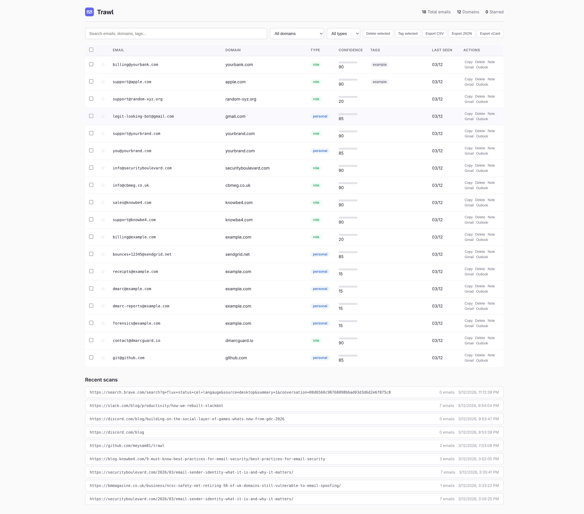

# Trawl

[](https://github.com/meysam81/trawl/actions/workflows/ci.yml)
[](LICENSE)
[](https://github.com/meysam81/trawl/releases)
[](https://github.com/meysam81/trawl/stargazers)

[](https://chromewebstore.google.com/detail/oceiggipjdnciogokidgkopppgmlobmg?utm_source=github&utm_medium=readme&utm_campaign=badge)
[](https://chromewebstore.google.com/detail/oceiggipjdnciogokidgkopppgmlobmg?utm_source=github&utm_medium=readme&utm_campaign=ext_users)
[](https://developer.chrome.com/docs/extensions/mv3/)

[](https://www.typescriptlang.org/)
[](https://vite.dev/)
[](https://bun.sh/)
[](https://zod.dev/)

[](#privacy)
[](#privacy)
[](https://github.com/meysam81/trawl/pulls)
[](https://github.com/sponsors/meysam81)

---

Zero-cloud email intelligence for Chrome. Extract, validate, and discover email addresses from any web page — no accounts, no subscriptions, no Hunter/Apollo/Snov.io required.



## Why Trawl?

- **Zero cloud** — all data lives in your browser's local storage. Nothing is ever transmitted to any server you don't control.
- **Zero cost** — no API keys, no subscriptions, no usage limits. Install and go.
- **Full pipeline** — extract → validate → discover → export, all in one extension.
- **Smart extraction** — decodes obfuscation (`[at]`, `{dot}`), HTML entities (`&#64;`), mailto links, JSON-LD, and data attributes.
- **Confidence scoring** — MX validation + disposable detection + source analysis = a 0–100 score for every address.

## Features

### Extract

Multi-layer email extraction: regex, 7 obfuscation patterns, 6 HTML entity forms, `mailto:` links, `data-email` attributes, and JSON-LD/schema.org blocks. Also extracts phone numbers and social URLs (LinkedIn, Twitter/X, GitHub, Facebook, Instagram, YouTube). Filters out false positives like image filenames and retina density patterns.

### Validate

MX record verification via DNS-over-HTTPS (Cloudflare primary, Google fallback) with 30-minute caching. Disposable domain detection against 43 known providers. Automatic classification into personal, role, or disposable. Provider identification (Gmail, Outlook, Yahoo, ProtonMail). Confidence score 0–100 for every address.

### Discover

Generate candidate emails from a person's name using 7 patterns (`first.last@`, `flast@`, etc.) and 14 role addresses (`info@`, `careers@`, `support@`, …). Detect contact/about/team pages on the current site. Fetch public commit emails from GitHub's Events API.

### Export

CSV (with formula injection protection), JSON (pretty-printed), vCard (properly escaped), and tab-separated clipboard copy. One-click compose links for Gmail and Outlook. Download any format as a file directly from the popup or dashboard.

### Dashboard

Full-tab management UI with search, domain/type filtering, bulk operations, tagging, notes, starring, and scan history. Everything you'd expect from a CRM — without the CRM.

### Auto-Scan

Background extraction as you browse. Configure domain allowlists and blocklists. Badge counter shows discovered emails per page. Desktop notifications when new addresses are found.

### Page Intel

Automatic page classification (company, blog, directory, e-commerce, personal, government, education). Social link extraction across 6 platforms. RDAP/WHOIS domain lookup for registrar, creation date, and expiry. Related page detection for contact, about, team, and career pages.

## Keyboard Shortcuts

| Shortcut    | Action                           |
| ----------- | -------------------------------- |
| `Alt+E`     | Extract emails from current page |
| `Alt+D`     | Open dashboard                   |
| Right-click | Extract from selected text       |

## Install

### Chrome Web Store

[**Install Trawl from the Chrome Web Store**](https://chromewebstore.google.com/detail/oceiggipjdnciogokidgkopppgmlobmg?utm_source=github&utm_medium=readme&utm_campaign=install)

### Manual

```sh
git clone https://github.com/meysam81/trawl.git
cd trawl
bun install
bun run build
```

Then open `chrome://extensions`, enable Developer mode, and load the `dist/` directory.

## Privacy

- **No accounts, no telemetry, no cloud.** Period.
- All data stored in `chrome.storage.local` — encrypted by Chrome, never synced.
- External network calls are limited to:
  - DNS-over-HTTPS (Cloudflare/Google) for MX lookups
  - GitHub API for public commit emails
  - RDAP for domain registration info
- Fully open source — [audit the code yourself](https://github.com/meysam81/trawl).
- Licensed under [MIT](LICENSE).

## Architecture

```
Popup ──→ Lib Modules ←── Dashboard
               ↑
Service Worker ←→ Content Script
```

**Data flow:** `schemas.ts` (Zod SoT) → `extract.ts` → `intelligence.ts` → `storage.ts` → `export.ts`

**Supporting:** `discovery.ts` · `page-intelligence.ts` · `logger.ts`

Every storage read/write is Zod-validated. Invalid data is logged and skipped — the extension never crashes on bad state.

## Development

```sh
bun install         # install dependencies
bun run start       # dev server with HMR
bun run build       # production build to dist/
bun run typecheck   # tsc --noEmit
bun run lint        # oxlint
bun run deadcode    # knip — unused exports/deps

# Use Google DNS primary instead of Cloudflare (default)
VITE_DNS_PRIMARY=google bun run build
```

**Stack:** TypeScript (strict) · Vite 7 · @crxjs/vite-plugin · Zod 4 · loglevel · oxlint · knip

## Contributing

PRs welcome — please open an issue first for large changes.

## Sponsors

[](https://github.com/sponsors/meysam81)
[](https://buymeacoffee.com/meysam)
[](https://patreon.com/meysam81)

## License

[MIT](LICENSE) — Copyright 2026 Meysam
